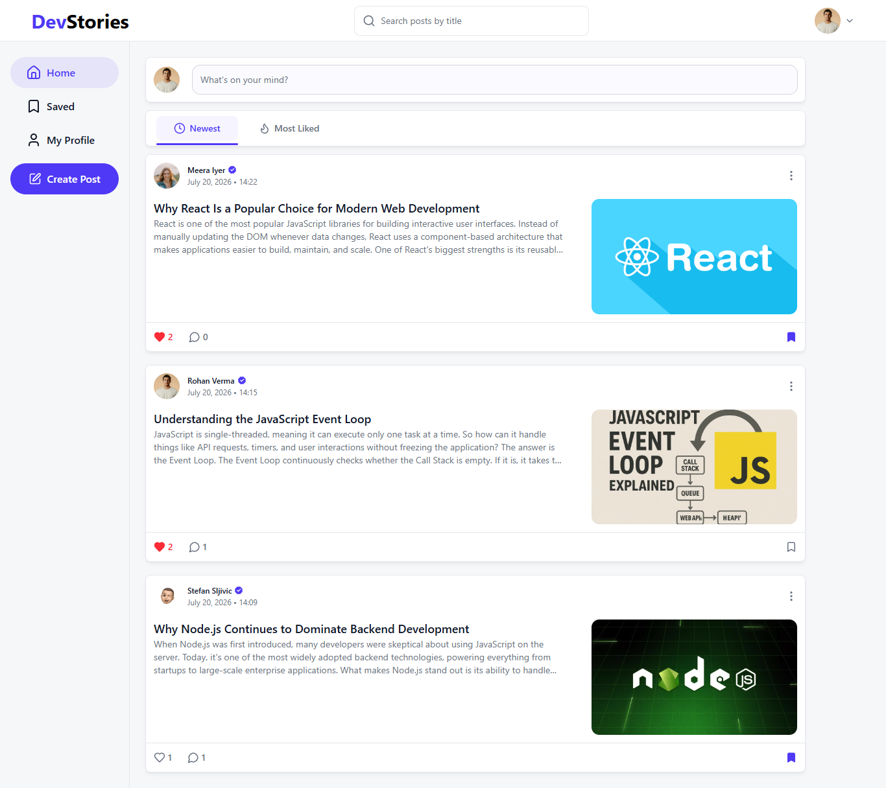
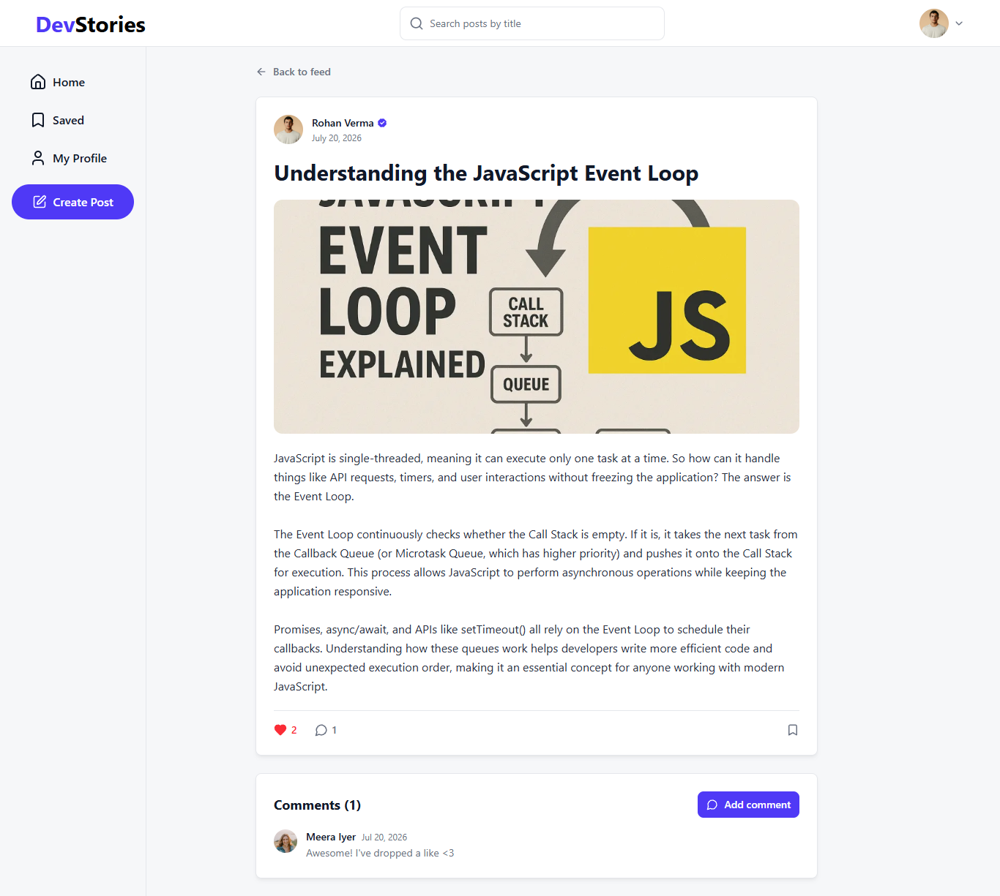
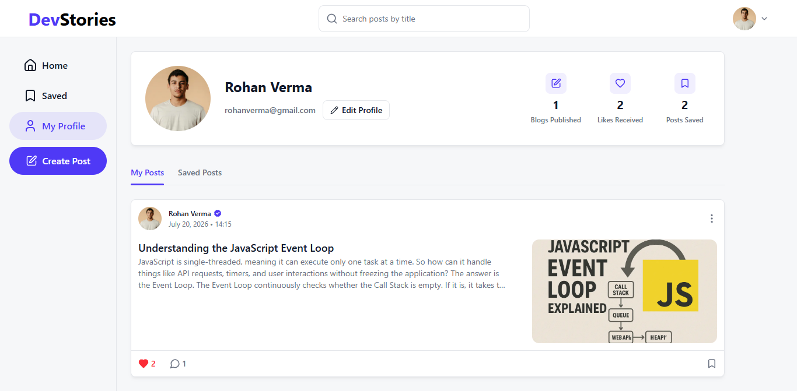

# DevStories

DevStories is a full-stack blog platform built for developers to share knowledge, discover articles, and engage with the community through likes, comments, and saved posts. It features user authentication, profile management, and full CRUD functionality for blog posts.

- **Live demo:** https://blog-app-ruddy-alpha-84.vercel.app
- **API:** https://blog-app-h24l.onrender.com

> The backend runs on a free tier, so the very first request after a period of
> inactivity can take up to a minute while the instance wakes up.

## Screenshots






## Features

- Sign up and log in (JWT), protected routes and a "continue as guest" mode
- Create, edit and delete posts, with a cover image
- Like, save (bookmark) and comment on posts
- Feed with sorting (newest / most liked)
- Debounced post search by title
- User profile with stats (posts published, likes received, posts saved)
- Public author profiles — reachable by clicking the author on a post
- Profile editing with avatar upload
- Responsive UI (bottom navigation and search modal on mobile)

## Tech stack

### Frontend

| Tool            | Version | Role                                           |
| --------------- | ------- | ---------------------------------------------- |
| React           | 19      | UI library                                     |
| TypeScript      | 6       | static typing                                  |
| Vite            | 8       | dev server and build                           |
| React Router    | 8       | routing (data mode, `createBrowserRouter`)     |
| TanStack Query  | 5       | server state: caching, mutations, invalidation |
| React Hook Form | 7       | forms                                          |
| Zod             | 4       | validation and type inference (`z.infer`)      |
| Tailwind CSS    | 4       | styling via design tokens                      |
| axios           | 1       | HTTP client with interceptors                  |
| react-icons     | 5       | icons (lucide set)                             |
| tailwind-merge  | 3       | conflict-free Tailwind class merging           |
| Vitest          | 4       | tests                                          |
| ESLint          | 10      | linting                                        |

### Backend

| Tool              | Version | Role                              |
| ----------------- | ------- | --------------------------------- |
| Node.js + Express | 5       | HTTP server and routing           |
| TypeScript        | 6       | static typing                     |
| Prisma            | 7       | ORM and migrations                |
| PostgreSQL        | —       | database (hosted on Neon)         |
| jsonwebtoken      | 9       | JWT tokens                        |
| bcrypt-ts         | 8       | password hashing                  |
| Zod               | 4       | request body validation           |
| slugify           | 1       | slug generation                   |
| tsx               | 4       | running TypeScript in development |
| Vitest            | 4       | tests                             |

### Infrastructure

| Service    | Role                                                               |
| ---------- | ------------------------------------------------------------------ |
| Vercel     | frontend hosting                                                   |
| Render     | backend hosting                                                    |
| Neon       | hosted PostgreSQL                                                  |
| Cloudinary | image upload and optimization (unsigned upload, `f_auto`/`q_auto`) |

## Project structure

The code is organized by feature rather than by file type.

```
frontend/src/
├── components/        # shared components (Modal, Avatar, Spinner, ErrorState…)
│   └── layout/        # Header, SideNav, BottomNav, Layout
├── features/
│   ├── auth/          # login, registration, route guard
│   ├── posts/         # feed, cards, like/save/comments, search
│   └── users/         # profile and stats
├── hooks/             # shared hooks (useDebounce, useClickOutside)
├── pages/             # route-level pages
├── routes/            # router and RequireAuth
└── services/          # axios instance, Cloudinary

backend/src/
├── routes/            # auth, posts, users
├── middleware/        # JWT, error handler
├── services/          # token, slug
├── types/             # Zod schemas and DTO types
└── lib/               # Prisma client
```

## Getting started

You'll need Node.js 20+ and a PostgreSQL database (a free Neon project works).

### Backend

```bash
cd backend
npm install
npx prisma migrate dev
npm run dev
```

### Frontend

```bash
cd frontend
npm install
npm run dev
```

> Restart the backend after every Prisma migration so the process picks up the
> newly generated Prisma client.

## Environment variables

### `backend/.env`

```
DATABASE_URL=postgresql://...
JWT_SECRET=...
PORT=3001
```

### `frontend/.env`

There's a `.env.example` to copy from.

```
VITE_API_URL=http://localhost:3001/api
VITE_CLOUDINARY_CLOUD_NAME=...
VITE_CLOUDINARY_UPLOAD_PRESET=...
```

The Cloudinary preset must be **unsigned** (Dashboard → Settings → Upload →
Upload presets → Signing Mode: Unsigned), because images are uploaded straight
from the client, without exposing an API secret on the frontend.

## Tests

```bash
cd backend && npm test
cd frontend && npm test
```

The tests cover the parts with non-trivial logic: unique slug generation (with
Prisma mocked), Zod schemas, and the predicate used for React Query cache
invalidation.

## API

| Method      | Route                        | Auth     | Description               |
| ----------- | ---------------------------- | -------- | ------------------------- |
| GET         | `/`                          | —        | health check              |
| POST        | `/api/auth/register`         | —        | register                  |
| POST        | `/api/auth/login`            | —        | log in                    |
| GET         | `/api/posts?sortBy=`         | optional | feed (newest / popular)   |
| GET         | `/api/posts/search?title=`   | —        | search by title           |
| GET         | `/api/posts/:slug`           | optional | post detail with comments |
| POST        | `/api/posts`                 | yes      | create a post             |
| PUT         | `/api/posts/:postId`         | yes      | update a post             |
| DELETE      | `/api/posts/:postId`         | yes      | delete a post             |
| POST/DELETE | `/api/posts/:postId/like`    | yes      | like                      |
| POST/DELETE | `/api/posts/:postId/save`    | yes      | save                      |
| POST/DELETE | `/api/posts/:postId/comment` | yes      | comment                   |
| GET         | `/api/users/me`              | yes      | own profile and stats     |
| PUT         | `/api/users/me`              | yes      | update profile            |
| GET         | `/api/users/me/posts`        | yes      | own posts                 |
| GET         | `/api/users/me/saved`        | yes      | saved posts               |
| GET         | `/api/users/:userId`         | —        | public user profile       |
| GET         | `/api/users/:userId/posts`   | optional | that user's posts         |

## What I'd add next

If I continued developing this project, I would add component tests, code splitting, feed pagination, and integrate the TipTap rich text editor for creating and editing posts. I would also implement content moderation to help detect spam and inappropriate language, making the platform more reliable and user-friendly.
